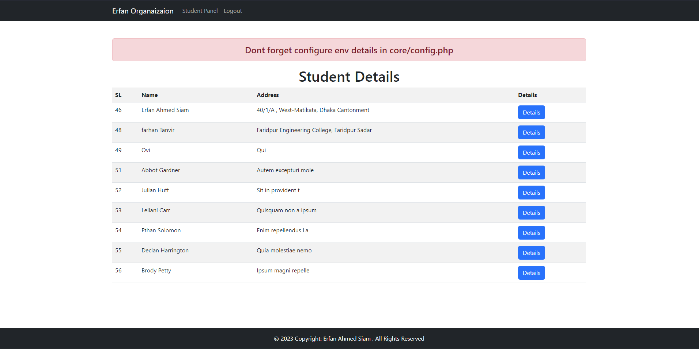
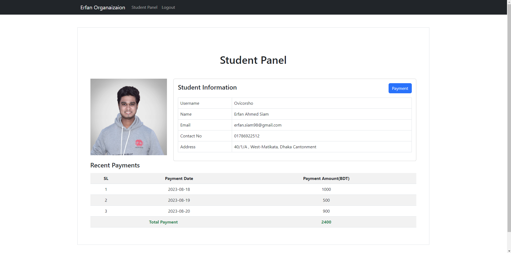
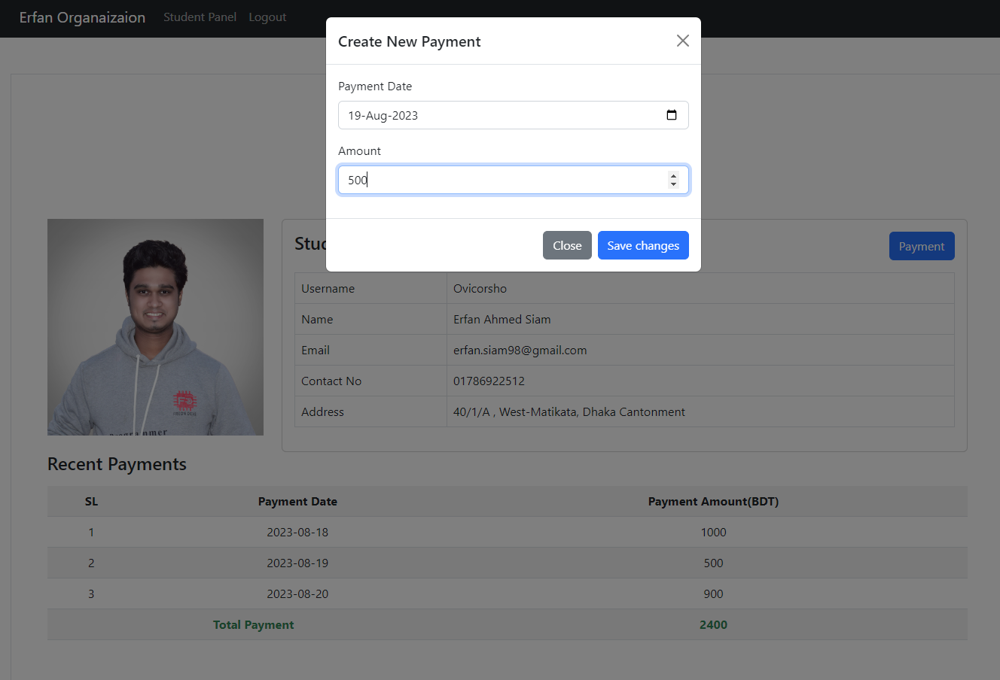
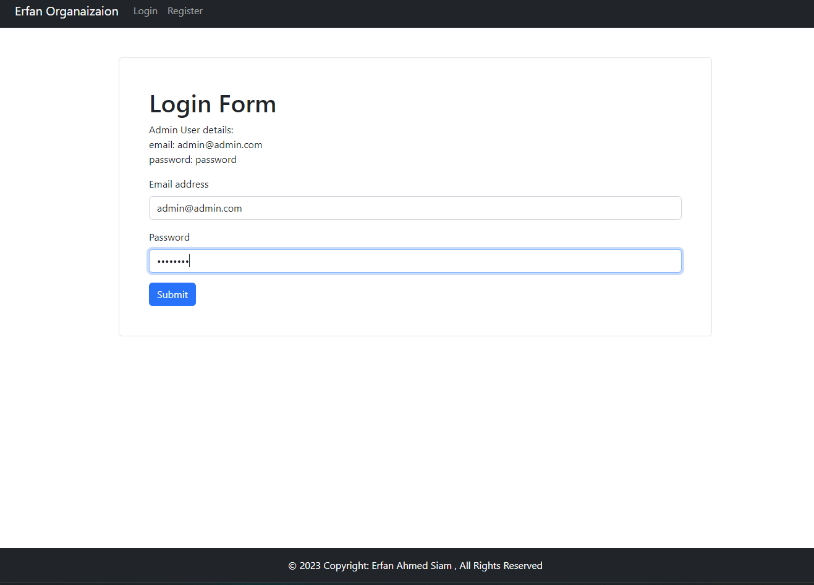
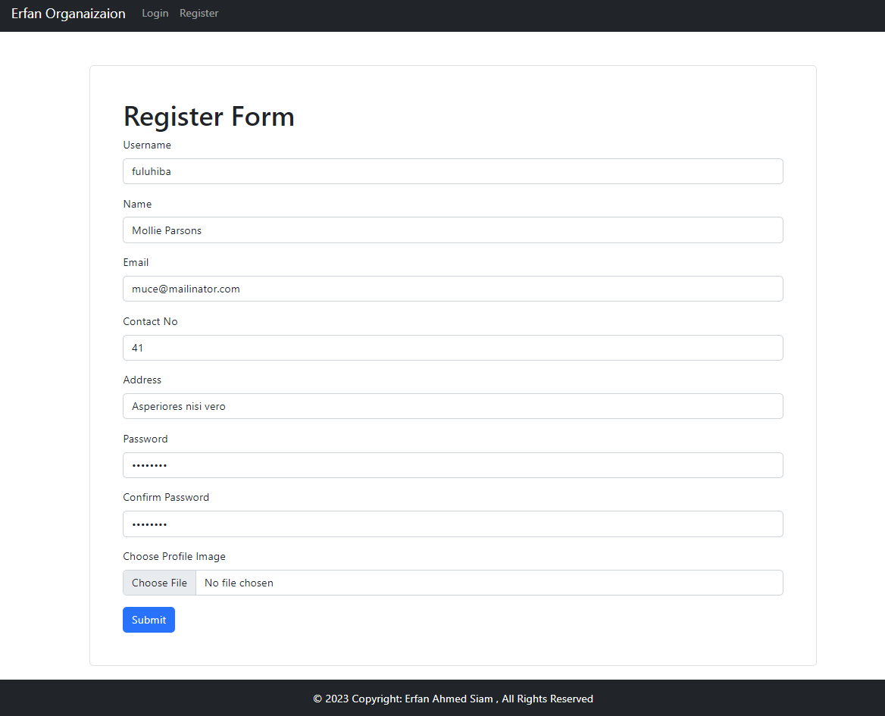
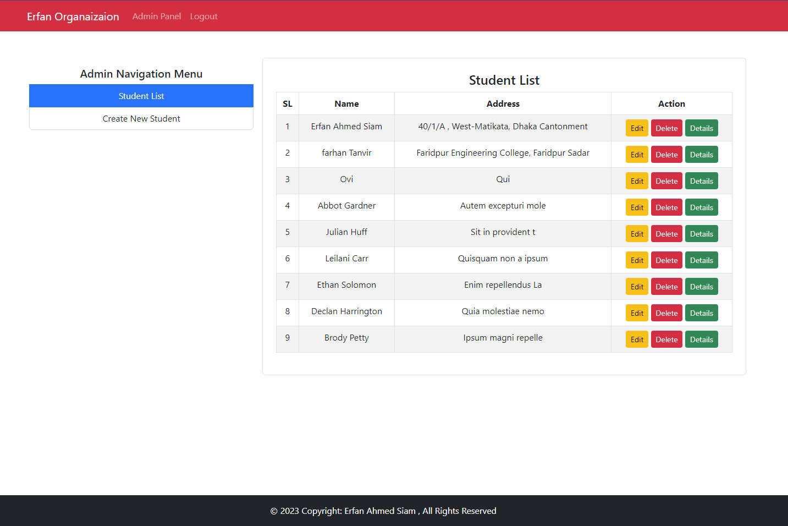
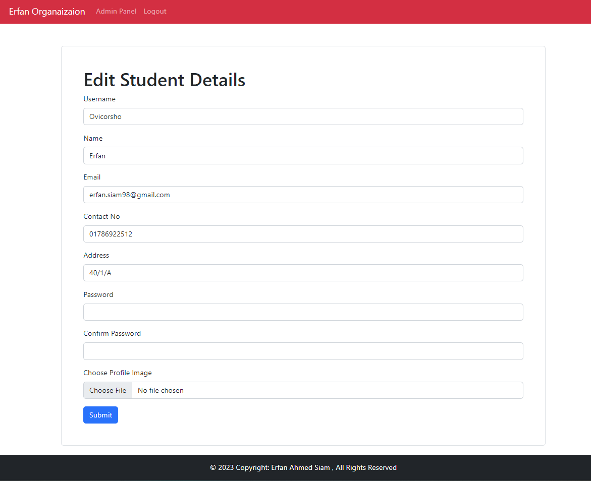

## Installation
1. Clone the repository
2. Import database.sql located in DB_DUMP directory into your database system.
3. Change the database credentials in core/config.php
4. Change the base url in core/config.php
   (Very Important).

## Usage
1. Admin Login
    - Email: admin@admin.com
    - Password: password

# Index Page

# Student Details Page

# Payment Modal Page

# Login Form

# Register Form

# Admin Panel Page

# Edit Student Details From Admin Panel

